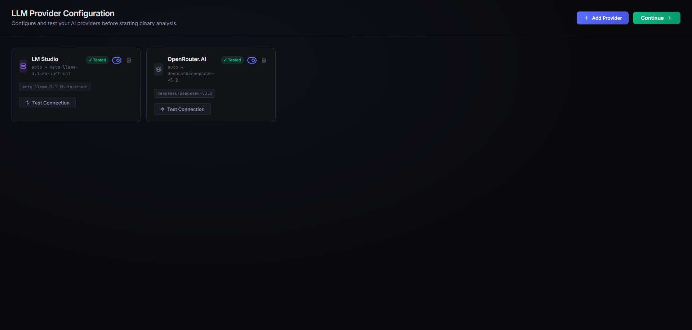
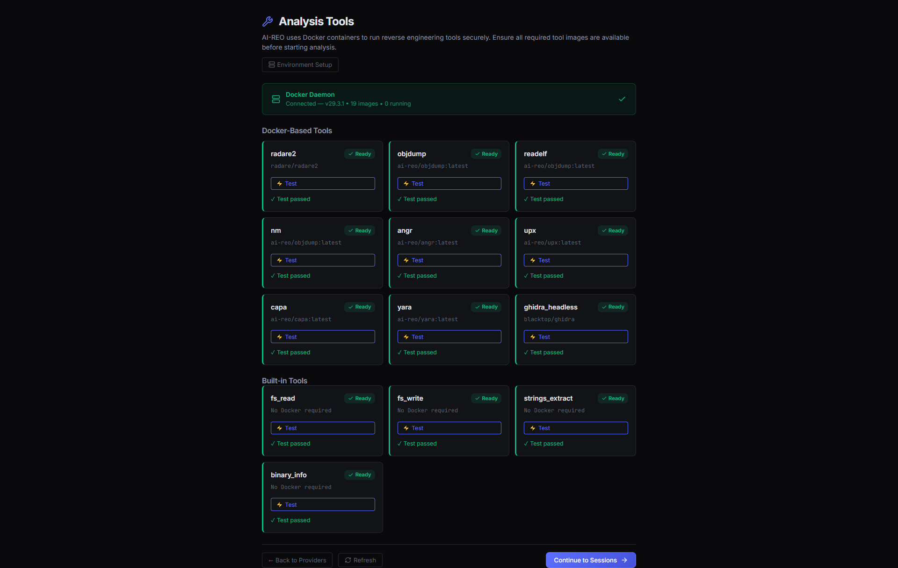
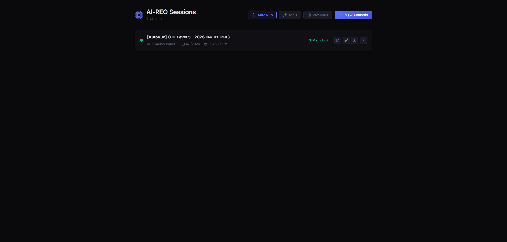
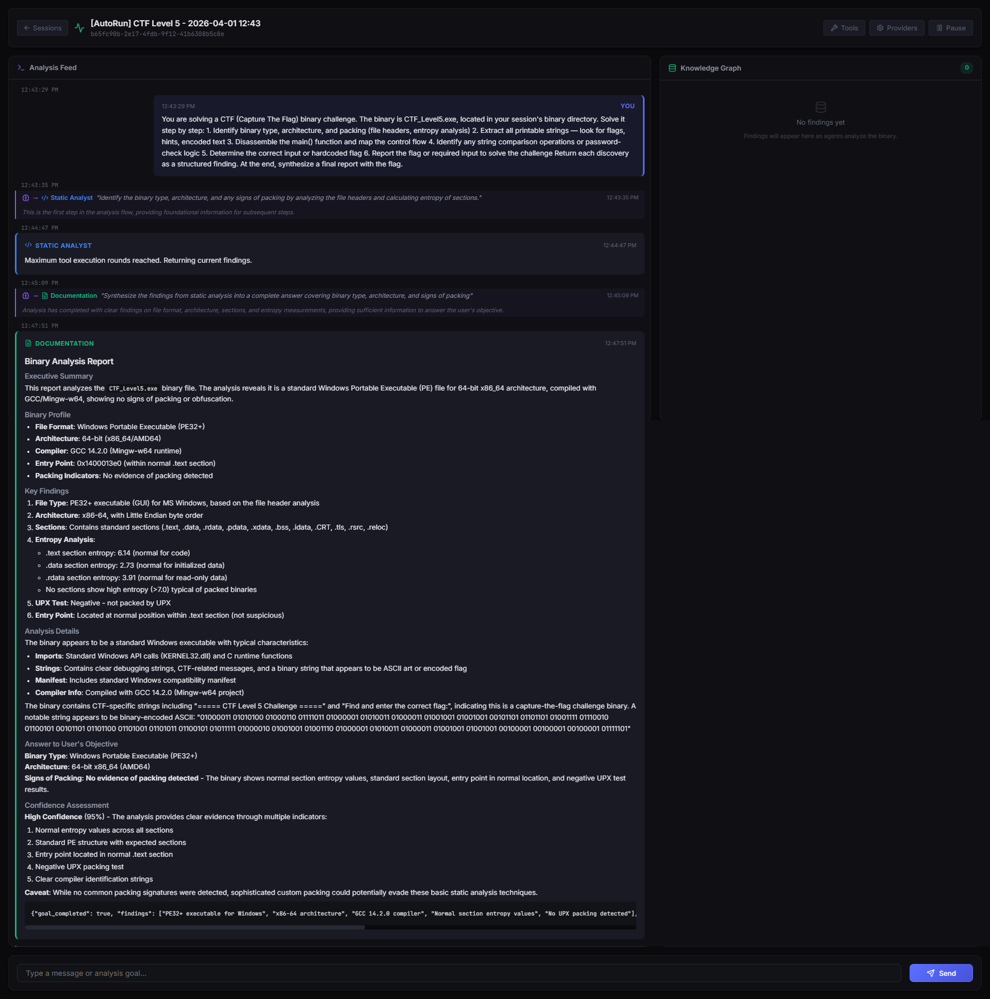
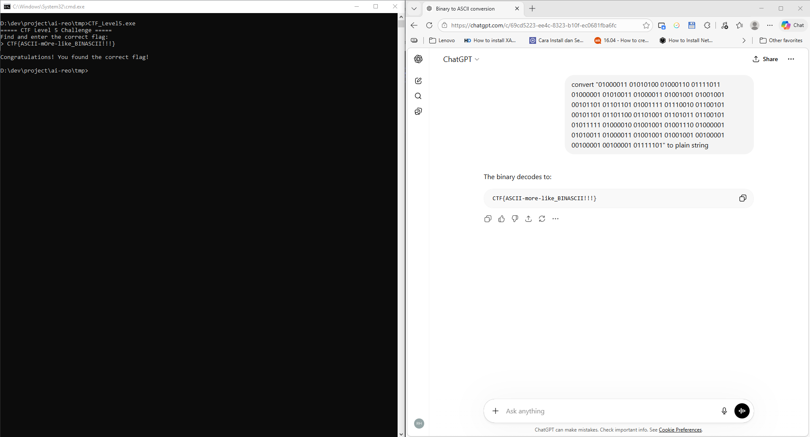

# AI-REO — AI Reverse Engineering Orchestrator

> **Local-first, chat-driven binary analysis powered by a team of specialized AI agents.**

AI-REO lets you drop a binary into a session and talk to it — asking questions like *"what does this binary do?"*, *"find any crypto routines"*, or *"is there an obvious vulnerability?"* — while a coordinated swarm of agents runs real analysis tools on your behalf in isolated Docker containers, streams findings back in real time, and builds an evolving knowledge graph of the target.

---

## How it works

```
┌──────────────────────────────────────────────────────────────────┐
│                     React / Vite Frontend                        │
│  Session Manager · Analysis Feed · Knowledge Graph · Providers   │
└────────────────────────────┬─────────────────────────────────────┘
                             │  WebSocket + REST (port 9000)
┌────────────────────────────▼─────────────────────────────────────┐
│                       FastAPI Backend                            │
│  ┌──────────────┐   ┌──────────────────────────────────────┐     │
│  │ LangGraph    │   │ Tool Registry                        │     │
│  │ Orchestrator ├──►│ radare2 · objdump · readelf · nm     │     │
│  │ StaticAnalyst│   │ angr · upx · capa · yara · ghidra    │     │
│  │ DynamicAnalst│   └──────────────┬───────────────────────┘     │
│  │ Documenter   │                  │ Docker containers           │
│  └──────┬───────┘                  │ (isolated, per-run)         │
│         │                          └──────────────────────────── │
│         ▼                                                        │
│  SQLite · Knowledge Graph · Session History                      │
└──────────────────────────────────────────────────────────────────┘
```

1. **Upload** a binary (ELF, PE, Mach-O, or raw shellcode) to a session.
2. **Ask** a natural-language goal in the chat bar.
3. The **Orchestrator** agent classifies intent, assigns sub-tasks, and routes to the right specialist.
4. Specialists call Docker-sandboxed tool runners — results stream instantly to the feed.
5. Findings accumulate in a **knowledge graph** that agents can query on subsequent turns.
6. A **Documentation** agent synthesises everything into a structured report.

---

## Feature Highlights

| Feature | Details |
|---|---|
| **Multi-agent graph** | LangGraph-powered: Orchestrator → Static Analyst → Dynamic Analyst → Documentation |
| **9 sandboxed tools** | radare2, objdump, readelf, nm, angr, UPX, capa (FLARE), YARA, Ghidra headless |
| **Any LLM** | OpenAI, Anthropic, Google Gemini, Mistral, Ollama, LM Studio, or any OpenAI-compatible endpoint via litellm |
| **Multiple providers** | Configure different models per agent; switch or add providers live from the UI |
| **Streaming feed** | Real-time WebSocket feed with per-agent colour-coded bubbles and 3-dot typing indicator |
| **Pause / Resume** | Interrupt and continue long-running analyses, logged to session history |
| **Knowledge graph** | D3-powered live graph of discovered symbols, strings, function relations |
| **Full history** | Every agent response + user message persisted to SQLite; survives server restart |
| **Session manager** | Create, rename, switch sessions; each session keeps its own binary + history |

---

## Screenshots







---

## Tech Stack

| Layer | Technology |
|---|---|
| Frontend | React 18, TypeScript, Vite, Lucide icons |
| API | FastAPI 0.111, WebSockets, REST |
| Agent workflow | LangGraph + LangChain-core |
| LLM routing | litellm (OpenAI / Anthropic / Google / Ollama / LM Studio / generic) |
| Database | SQLite via SQLAlchemy 2 + Alembic migrations |
| Analysis tools | Docker containers (radare2, Ghidra, objdump, angr, capa, YARA, UPX, …) |
| Python | 3.11+ |

---

## Quick Start

### Prerequisites

- Python 3.11+
- Node.js 18+ (for frontend dev server)
- Docker Engine with internet access (to pull tool images on first run)

### 1 — Backend

```bash
# Clone
git clone https://github.com/mrizkihidayat66/ai-reo.git
cd ai-reo

# Virtual environment
python -m venv .venv
.venv\Scripts\activate      # Windows
# source .venv/bin/activate  # Linux / macOS

# Install (editable mode includes dev extras)
pip install -e ".[dev]"

# Configure
copy .env.example .env     # Windows
# cp .env.example .env     # Linux / macOS

# Start backend (default: http://localhost:8000)
ai-reo
# or: uvicorn ai_reo.main:app --reload --port 8000
```

### 2 — Frontend

```bash
cd frontend
npm install
npm run dev   # http://localhost:5173
```

### 3 — Verify

```bash
# Liveness
curl http://localhost:8000/health

# Readiness (DB + Docker daemon)
curl http://localhost:8000/ready
```

### Environment variables

```ini
# Server
AI_REO_HOST=127.0.0.1
AI_REO_PORT=8000
AI_REO_LOG_LEVEL=info

# Database
AI_REO_DATABASE_URL=sqlite:///~/.ai-reo/sessions.db

# Tool Integration & Storage
AI_REO_SESSIONS_DIR=tmp/.ai-reo/sessions
AI_REO_DOCKER_NETWORK=ai-reo-tools
```

---

## Project Structure

```
ai-reo/
├── src/ai_reo/
│   ├── agents/          # LangGraph agent nodes (orchestrator, specialists)
│   ├── api/             # FastAPI routes, WebSocket manager, schemas
│   ├── db/              # SQLAlchemy models, repositories, services
│   ├── llm/             # litellm provider abstraction, prompt loader
│   ├── prompts/         # Per-agent system prompt JSON files
│   ├── tools/           # Tool registry, Docker executor, native tools
│   ├── config.py        # Pydantic-Settings configuration
│   ├── exceptions.py    # Domain exception hierarchy
│   └── main.py          # FastAPI app + Uvicorn entry point
├── frontend/            # React / Vite SPA
│   └── src/
│       ├── components/  # AnalysisDashboard, SessionManager, GraphPanel, …
│       └── context/     # WebSocketContext, ProvidersContext
├── docker/
│   └── Dockerfile.*     # One Dockerfile per sandboxed tool
├── tests/
│   └── unit/            # pytest unit tests
├── docs/                # Architecture, database schema, API spec
├── pyproject.toml
├── requirements.txt
└── .env.example
```

---

## Analysis Tools

| Tool | Image | What it does |
|---|---|---|
| **radare2** | `radare2/radare2` | Disassembly, function list, strings, call graph |
| **objdump** | custom (`Dockerfile.objdump`) | Section headers, raw disassembly |
| **readelf** | same as objdump | ELF structure, dynamic symbols, segment info |
| **nm** | same as objdump | Symbol table extraction |
| **angr** | custom | Symbolic execution, CFG, function discovery |
| **UPX** | custom | Packer detection and decompression |
| **capa** | `fireeye/capa` (FLARE) | MITRE ATT&CK capability detection |
| **YARA** | custom | Rule-based pattern matching |
| **Ghidra headless** | custom | Deep decompilation and P-code analysis |

All containers mount the session's binary read-only and are torn down after each run.

---

## Running Tests

```bash
pytest tests/unit/ -q
```

Expected: **5 passed**.

---

## Roadmap / Known Limitations

- [ ] Persistent Neo4j knowledge graph (currently in-process D3 only)
- [ ] Agent-to-agent memory across sessions
- [ ] WASM / macOS Mach-O tool coverage

---

## ⚗️ Experimental Project

This is an **experimental, work-in-progress** project. The architecture, APIs, and
database schema may change without notice between commits. It is intended for local
use and security research in controlled environments only.

**Suggestions, bug reports, and pull requests are warmly welcome!**
If you have ideas for new agents, tools, UI improvements, or architectural changes,
please open an issue or submit a PR. no contribution is too small.

---

## License

MIT — see [LICENSE](LICENSE) for details.
